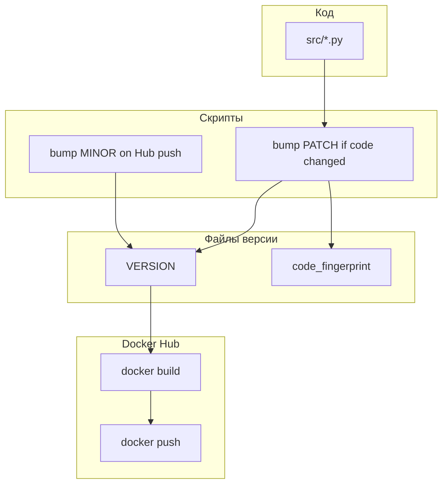

# Версия сервиса, Telegram и CHANGELOG

Копия актуального плана (в т.ч. правила MINOR/PATCH): синхронизируйте с `~/.cursor/plans/version_and_changelog_9b418b49.plan.md` при расхождении.

## Правила MAJOR / MINOR / PATCH

| Часть | Когда меняется | Как |
|--------|----------------|-----|
| **MAJOR** | Редко, ломающие изменения | Вручную правка `VERSION` (или отдельный шаг в документации). |
| **MINOR** | Каждая **сборка Docker-образа и успешный push на Docker Hub** | Скрипт в конвейере push ([scripts/docker-hub-vps.sh](scripts/docker-hub-vps.sh) `hub-build-push`, и при появлении — GitHub Actions): перед `docker build` увеличить MINOR на 1 и записать в `VERSION`. Локальный `docker compose build` без push **не** обязан трогать MINOR. |
| **PATCH** | Каждое изменение **файлов с кодом проекта** | Скрипт вычисляет отпечаток набора путей (минимум `src/**/*.py`; при необходимости `requirements.txt` и др.). Сравнение с `.version/code_fingerprint`. Если изменился — **PATCH += 1**, обновить `VERSION` и fingerprint. Запуск: вручную / pre-commit / CI — выбрать один основной способ при реализации. |

**Согласование MINOR и PATCH:** сначала обновление PATCH при изменении кода, при Hub-push — MINOR++; по умолчанию PATCH **не** сбрасывать при MINOR.

**Источник правды:** [VERSION](VERSION), закоммиченный [.version/code_fingerprint](.version/code_fingerprint). [src/version.py](src/version.py) читает `VERSION`; при отсутствии — fail fast.

## Telegram

См. полный план: `split_for_telegram` с баннером версии (учёт лимита 4096), `send_formatted_text`, `pipeline`, `main` (лог и `/start`).

## Docker и Docker Hub

`COPY VERSION` в Dockerfile; опционально `LABEL`; `hub-build-push` — bump MINOR перед `docker build`, не инкрементировать при неуспешном push; [DEPLOY.md](DEPLOY.md) — порядок шагов.

## Документация

README, CHANGELOG.md, поле About на GitHub вручную.

## Диаграмма

