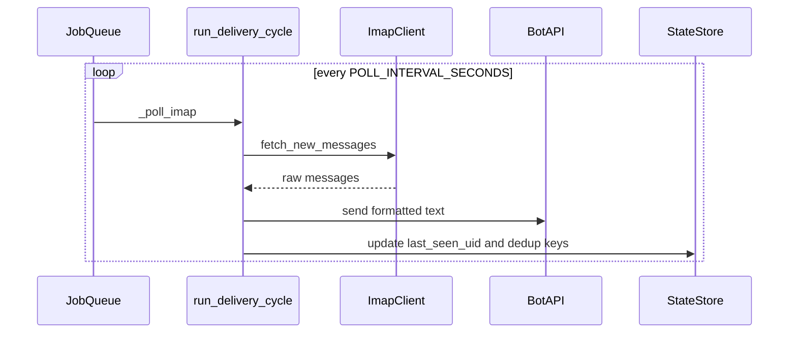
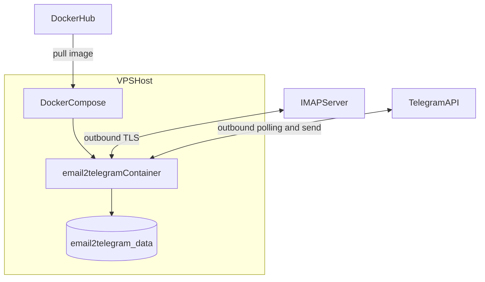

# Architecture

The service is a single containerized process that polls IMAP and forwards text to Telegram.
No inbound ports are exposed.

## Module responsibilities (`src/`)

| Module | Role |
|--------|------|
| `main.py` | Process entry: `python-telegram-bot` app, `JobQueue`, command handlers, wires IMAP polling → `run_delivery_cycle`, allowlist enforcement. |
| `imap_client.py` | IMAP connection and fetch; blocking I/O called from async via `asyncio.to_thread`. |
| `parser.py` | Parse raw RFC822 bytes into structured fields for the pipeline. |
| `pipeline.py` | `run_delivery_cycle`: orchestrate fetch, dedup, format, Telegram send, state updates. |
| `telegram_client.py` | Send formatted chunks to Telegram (chunking / API details). |
| `message_format.py` | Plain-text email formatting and `split_for_telegram` limits. |
| `allowlist.py` | Parse and represent allowed chat IDs; used by handlers and sender. |
| `state.py` | Persistent cursor / dedup store (`StateStore`, file under `STATE_FILE`). |
| `imap_probe.py` | Standalone IMAP connectivity and mailbox preview (no Telegram). |
| `version.py` | Version string / banner for logs and Telegram. |

Imports between `src/` modules use **no** `src.` prefix (entrypoint is `python src/main.py` with `src` on the path).

## Runtime Components

- Docker Engine + Compose on VPS.
- App container (`python src/main.py`).
- Persistent volume `email2telegram_data` mounted to `/data`.
- Optional systemd timer for periodic image refresh from Docker Hub.

## Data Flow

## Deploy Topology

