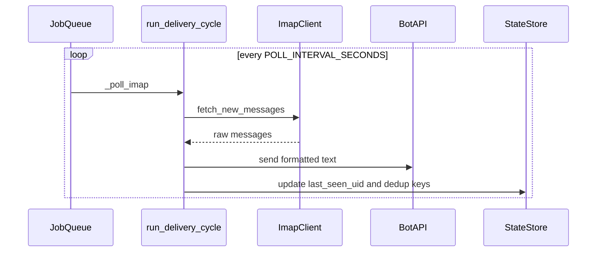
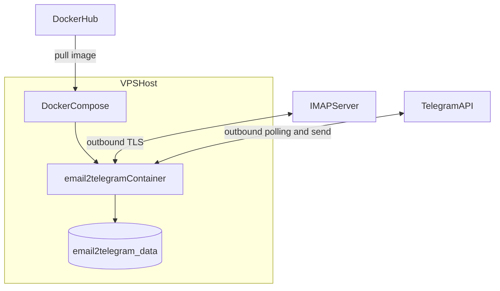

# Architecture

The service is a single containerized process that polls IMAP and forwards text to Telegram.
No inbound ports are exposed.

## Runtime Components

- Docker Engine + Compose on VPS.
- App container (`python src/main.py`).
- Persistent volume `email2telegram_data` mounted to `/data`.
- Optional systemd timer for periodic image refresh from Docker Hub.

## Data Flow

## Deploy Topology

