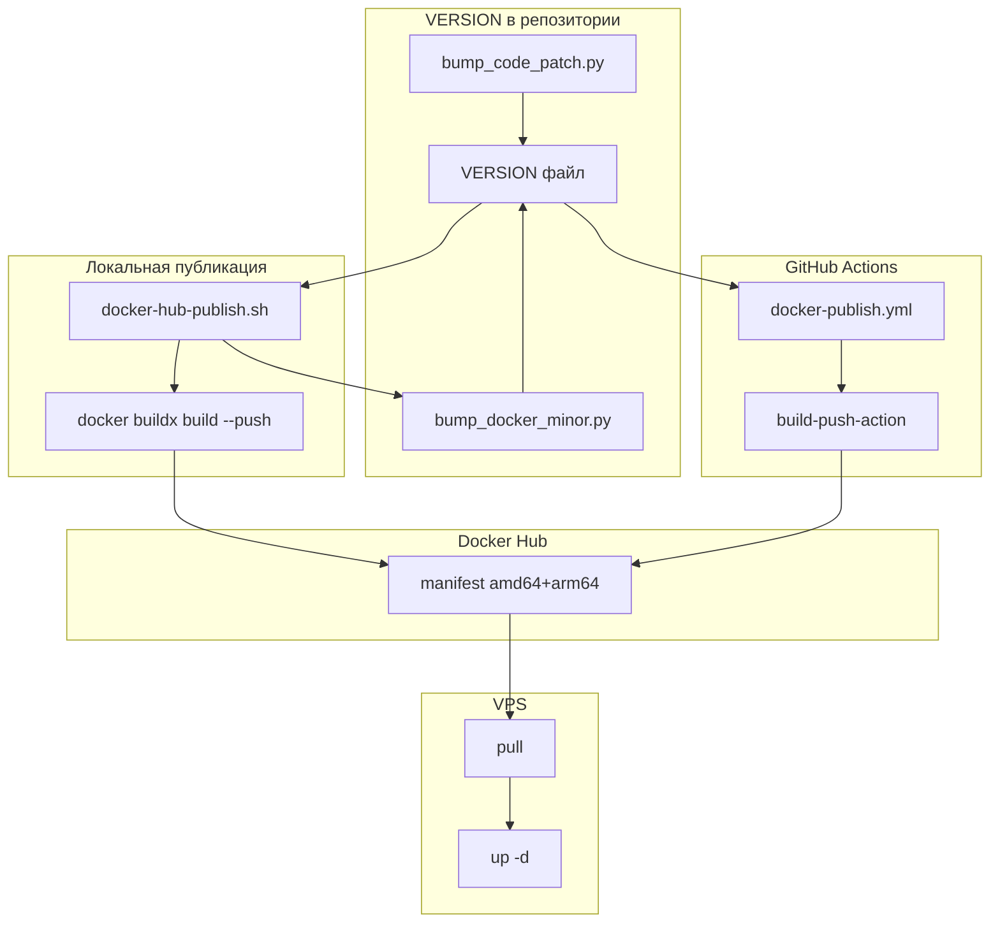

# Детальный план: сборка образа, Docker Hub, VPS (актуальная цепочка)

Документ описывает **текущие** шаги и **все взаимосвязи** после изменений: multi-arch (`linux/amd64`, `linux/arm64`), `buildx --push`, единая точка публикации `[scripts/docker-hub-publish.sh](../scripts/docker-hub-publish.sh)`, автоматический bump **MINOR** в `[VERSION](../VERSION)`, метка образа `APP_VERSION`, GitHub Actions, деплой на VPS.

---

## 1. Артефакты и имена


| Место           | Артефакт                                                                                                                               |
| --------------- | -------------------------------------------------------------------------------------------------------------------------------------- |
| Контекст сборки | корень репозитория, `[Dockerfile](../Dockerfile)`                                                                                      |
| Версия в репо   | файл `[VERSION](../VERSION)`, формат `MAJOR.MINOR.PATCH`                                                                               |
| Версия в образе | build-arg `APP_VERSION` → `LABEL org.opencontainers.image.version` в Dockerfile; в образ копируется `VERSION`                          |
| Образ на Hub    | `DOCKER_USER/email2telegram:TAG` (часто `latest`) и второй тег `:GIT_SHORT_SHA` (локально) или `:GITHUB_SHA` (CI)                      |
| VPS             | каталог `/opt/email2telegram`: `docker-compose.hub.yml`, `.env`, опционально `vps-update-hub.sh`, `email2telegram.service`, таймер `email2telegram-hub-update.*` |
| Compose на VPS  | `[docker-compose.hub.yml](../docker-compose.hub.yml)`: `image: ${DOCKER_IMAGE}`, том `email2telegram_data`, контейнер `email2telegram` |
| Состояние       | в контейнере `STATE_FILE=/data/.state.json`                                                                                            |


Строка `**DOCKER_IMAGE`** в `.env` на VPS должна совпадать с публикуемым образом, например `yourhub/email2telegram:latest`.

---

## 2. Версионирование (две оси)

### PATCH (`MAJOR.MINOR.PATCH`)

- Скрипт `[scripts/bump_code_patch.py](../scripts/bump_code_patch.py)`: при изменении отслеживаемого кода (`src/**/*.py`, `requirements.txt`) обновляет отпечаток `.version/code_fingerprint` и при необходимости увеличивает **PATCH** в `VERSION`.
- Запуск вручную при разработке (когда нужно зафиксировать новый PATCH по правилам проекта).

### MINOR (перед каждой публикацией в Hub с ПК)

- Скрипт `[scripts/bump_docker_minor.py](../scripts/bump_docker_minor.py)` вызывается **всегда** из `[scripts/docker-hub-publish.sh](../scripts/docker-hub-publish.sh)` **перед** `docker buildx build`: увеличивается **MINOR**, **PATCH** в файле остаётся тем, что был (логика скрипта: `minor += 1`, patch без изменений в этом шаге — см. код).
- После успешного push рекомендуется **закоммитить обновлённый `VERSION`** в git (сообщение об этом печатает `docker-hub-publish.sh`).

### GitHub Actions

- Workflow **не** вызывает `bump_docker_minor.py`: `APP_VERSION` берётся из **текущего** `VERSION` в репозитории на момент checkout (шаг «Read app version»).

---

## 3. Сборка и push: единая точка входа (локально)

Файл: `[scripts/docker-hub-publish.sh](../scripts/docker-hub-publish.sh)`.

Последовательность:

1. `DOCKER_USER` обязателен; `TAG` по умолчанию `latest`.
2. Короткий SHA коммита: `git rev-parse --short HEAD` (или `local` без git).
3. `**python3 scripts/bump_docker_minor.py`** → обновляется `[VERSION](../VERSION)`.
4. Чтение версии: `ver=$(tr -d '[:space:]' < VERSION)`.
5. `**docker buildx build`**:
  - `--platform linux/amd64,linux/arm64`
  - `--build-arg APP_VERSION=$ver`
  - теги: `DOCKER_USER/email2telegram:TAG` и `DOCKER_USER/email2telegram:$sha`
  - `**--push**` (отдельного `docker push` нет).

Требования: `**docker login**` на Hub; активный buildx builder с возможностью push (на Apple Silicon так VPS на `amd64` получает свой слой за счёт multi-platform manifest).

Команды-обёртки (все ведут в тот же сценарий):

- `DOCKER_USER=… ./scripts/docker-hub-publish.sh`
- `make hub-push DOCKER_USER=…` → `[Makefile](../Makefile)`: `hub-build` вызывает `docker-hub-publish.sh`; цель `hub-push` — алиас к `hub-build`.
- `DOCKER_USER=… ./scripts/docker-hub-vps.sh hub-build-push` → `exec docker-hub-publish.sh`.

Справка по Hub в браузере / PAT: `./scripts/docker-hub-vps.sh hub-checklist`.

---

## 4. GitHub Actions

Файл: `[.github/workflows/docker-publish.yml](../.github/workflows/docker-publish.yml)`.

Триггеры: `workflow_dispatch`, push тега `v*`.

Шаги:

1. Checkout.
2. `VERSION` → output `APP_VERSION` для build-arg.
3. `docker/setup-qemu-action`, `docker/setup-buildx-action`.
4. Login в Hub (`DOCKERHUB_USERNAME`, `DOCKERHUB_TOKEN`).
5. `docker/build-push-action`: `platforms: linux/amd64,linux/arm64`, `build-args: APP_VERSION`, теги `:latest` и `:${{ github.sha }}`.

**Отличие от локального publish:** нет bump MINOR в workflow — версия в образе равна содержимому `VERSION` в коммите, который собирает Actions.

---

## 5. Dockerfile (связь с версией)

`[Dockerfile](../Dockerfile)`:

- `COPY VERSION ./VERSION` — файл доступен в образе.
- `ARG APP_VERSION=unknown` + `LABEL org.opencontainers.image.version="${APP_VERSION}"` — метаданные образа на Hub.

---

## 6. Скрипт `docker-hub-vps.sh`: как пользоваться

Скрипт запускается **на вашем ПК** из корня клона репозитория (или из любой директории — он сам находит корень по своему пути). Файл: `[scripts/docker-hub-vps.sh](../scripts/docker-hub-vps.sh)`.

### 6.1. Общий синтаксис

```text
./scripts/docker-hub-vps.sh [опции] <команда> [аргументы команды]
```

**Опции** задаются **до** имени команды (порядок важен только для `-p`):


| Опция                       | Альтернатива                        | Назначение                                                       |
| --------------------------- | ----------------------------------- | ---------------------------------------------------------------- |
| `-h`, `--help`              | —                                   | Справка и список команд                                          |
| `-p PORT` или `--port PORT` | переменная окружения `VPS_SSH_PORT` | Порт SSH/SCP, если не 22 (как у `ssh -p`)                        |
| —                           | `VPS_SSH_OPTS`                      | Доп. аргументы для `ssh`/`scp`, например `-i ~/.ssh/vps_ed25519` |


Примеры с нестандартным портом:

```bash
./scripts/docker-hub-vps.sh -p 2222 scp-compose deploy@203.0.113.10
VPS_SSH_PORT=2222 ./scripts/docker-hub-vps.sh vps-up-remote deploy@203.0.113.10
VPS_SSH_OPTS='-i ~/.ssh/vps' ./scripts/docker-hub-vps.sh scp-compose deploy@203.0.113.10
```

### 6.2. Команды по отдельности

#### `hub-checklist`

Печатает шаги в браузере (репозиторий на Docker Hub, PAT) и напоминает основную команду публикации. **На VPS не нужна.**

```bash
./scripts/docker-hub-vps.sh hub-checklist
```

#### `hub-build-push`

Полностью делегирует `[scripts/docker-hub-publish.sh](../scripts/docker-hub-publish.sh)`: bump **MINOR** в `VERSION`, multi-arch `buildx`, push в Hub. Требуется заранее `**docker login`**.

```bash
docker login -u YOUR_HUB_USER
DOCKER_USER=YOUR_HUB_USER ./scripts/docker-hub-vps.sh hub-build-push
```

Опционально другой тег: `TAG=v1 ./scripts/docker-hub-vps.sh hub-build-push` (после установки `DOCKER_USER` в окружении).

Эквиваленты: `DOCKER_USER=… ./scripts/docker-hub-publish.sh`, `make hub-push DOCKER_USER=…`.

#### `scp-compose <user@host>`

Копирует на VPS в каталог `**/opt/email2telegram/**` (через `scp`):


| Локальный файл                              | На VPS после копирования                              | Зачем на VPS                                                    |
| ------------------------------------------- | ----------------------------------------------------- | --------------------------------------------------------------- |
| `docker-compose.hub.yml`                    | `/opt/email2telegram/docker-compose.hub.yml`          | Описание сервиса: образ из `DOCKER_IMAGE`, том, логи            |
| `deploy/vps-update-hub.sh`                  | `/opt/email2telegram/vps-update-hub.sh`               | Удобное обновление: `pull` + `up -d` из каталога                |
| `deploy/email2telegram.service`             | `/opt/email2telegram/email2telegram.service`          | Шаблон unit systemd (потом копируется в `/etc/systemd/system/`) |
| `deploy/email2telegram-hub-update.service`  | `/opt/email2telegram/email2telegram-hub-update.service` | Опционально: oneshot для периодического `pull` (см. DEPLOY.md)   |
| `deploy/email2telegram-hub-update.timer`    | `/opt/email2telegram/email2telegram-hub-update.timer`   | Опционально: запуск раз в 10 минут                               |


**Перед первым `scp-compose` на VPS** (один раз):

```bash
sudo mkdir -p /opt/email2telegram
sudo chown "$USER":"$USER" /opt/email2telegram
```

Пример с ПК:

```bash
./scripts/docker-hub-vps.sh scp-compose deploy@YOUR_VPS_IP
```

После копирования на VPS желательно сделать скрипт обновления исполняемым:

```bash
chmod +x /opt/email2telegram/vps-update-hub.sh
```

**Что скрипт `scp-compose` не копирует** (и обычно **не нужно** тащить на VPS):

- `scripts/docker-hub-vps.sh` — только для ПК
- `scripts/docker-hub-publish.sh` — только для сборки/push
- Исходники `src/`, `Dockerfile` — не нужны при работе с образом из Hub
- `.env` — создаётся **вручную на сервере** (секреты), не из репозитория

#### `vps-install-docker`

Только **выводит текст** с командами установки Docker на Ubuntu. Ничего не выполняет на удалённой машине.

```bash
./scripts/docker-hub-vps.sh vps-install-docker
```

#### `vps-up-remote <user@host> [каталог]`

По **SSH** заходит на сервер, переходит в каталог (по умолчанию `/opt/email2telegram`) и выполняет:

`docker compose -f docker-compose.hub.yml pull && … up -d && … ps`

Удобно обновить стек **с ПК** после нового push в Hub. Второй аргумент — другой путь на сервере, если не используете `/opt/email2telegram`.

```bash
./scripts/docker-hub-vps.sh vps-up-remote deploy@YOUR_VPS_IP
./scripts/docker-hub-vps.sh -p 2222 vps-up-remote deploy@YOUR_VPS_IP /srv/email2telegram
```

#### `vps-enable-hub-timer <user@host> [каталог]`

По **SSH** с `-t` (для пароля `sudo`): копирует `email2telegram-hub-update.{service,timer}` из каталога проекта на VPS в `/etc/systemd/system/`, `daemon-reload`, `enable --now` таймера. Файлы должны уже лежать на сервере (например после `scp-compose`).

#### `hub-deploy-vps <user@host> [каталог]`

Цепочка **деплоя через Hub с ПК**: `scp-compose` → `vps-up-remote` → `vps-enable-hub-timer`. На VPS заранее нужен `.env` с `DOCKER_IMAGE` и секретами; для приватного образа — один раз `docker login` на сервере.

```bash
./scripts/docker-hub-vps.sh hub-deploy-vps deploy@YOUR_VPS_IP
```

Подробности: [DEPLOY.md](../DEPLOY.md) (раздел **Docker Hub → E** и **section 7**).

#### `systemd-hints`

Печатает команды установки unit из `**/opt/email2telegram/email2telegram.service**` в systemd.

```bash
./scripts/docker-hub-vps.sh systemd-hints
```

На VPS после копирования через `scp-compose`:

```bash
sudo cp /opt/email2telegram/email2telegram.service /etc/systemd/system/
sudo systemctl daemon-reload
sudo systemctl enable --now email2telegram.service
```

### 6.3. Типичный сценарий «с нуля»

1. На VPS: пользователь, Docker, каталог `/opt/email2telegram` и права (см. выше).
2. На ПК: `./scripts/docker-hub-vps.sh scp-compose user@vps`
3. На VPS: создать `.env` (`DOCKER_IMAGE`, IMAP, Telegram), `chmod 600 .env`, при приватном образе — `docker login`.
4. На VPS: `chmod +x vps-update-hub.sh`; первый запуск: `docker compose -f docker-compose.hub.yml pull && docker compose -f docker-compose.hub.yml up -d` **или** `./vps-update-hub.sh`.
5. Дальше обновления образа: с ПК `./scripts/docker-hub-vps.sh vps-up-remote user@vps` или на VPS `./vps-update-hub.sh`; либо первично всё сразу: `./scripts/docker-hub-vps.sh hub-deploy-vps user@vps` (включает таймер раз в 10 минут).
6. По желанию: автозапуск стека при загрузке — systemd по выводу `systemd-hints`.
7. Таймер периодического `pull` с Hub: входит в `hub-deploy-vps`; иначе вручную — [DEPLOY.md section 7](../DEPLOY.md).

### 6.4. Файлы на VPS (сводка)


| Файл                               | Обязателен                                    | Откуда берётся                                      |
| ---------------------------------- | --------------------------------------------- | --------------------------------------------------- |
| `docker-compose.hub.yml`           | да                                            | `scp-compose` или ручной `scp`                      |
| `.env`                             | да                                            | только вручную на VPS (шаблон `.env.example` на ПК) |
| `vps-update-hub.sh`                | нет, но удобно                                | `scp-compose`                                       |
| `email2telegram.service`           | нет (только если нужен автозапуск)            | `scp-compose`                                       |
| `email2telegram-hub-update.*`      | нет (только если нужен автоматический `pull`) | `scp-compose`                                       |


Данные контейнера (в т.ч. `.state.json`) живут в Docker-томе `email2telegram_data`, а не в этих файлах.

---

## 7. Схема потоков (mermaid)




---

## 8. Полный чеклист «от кода до VPS»

1. Разработка; при необходимости PATCH: `python3 scripts/bump_code_patch.py` (по правилам репо).
2. Закоммитить код (и `VERSION` после bump_patch, если менялся).
3. `docker login -u …`
4. `DOCKER_USER=… ./scripts/docker-hub-publish.sh` (или `make hub-push` / `hub-build-push`).
5. Закоммитить **новый** `VERSION` после успешного push.
6. На VPS: `.env` с `DOCKER_IMAGE`, при необходимости `docker login`.
7. `pull` + `up -d` (или `vps-update-hub.sh`, или `vps-up-remote` с ПК).

Подробности по сети, UFW и путям: `[DEPLOY.md](../DEPLOY.md)`.

---

## 9. Частые риски


| Проблема                               | Причина                                                                                                                  |
| -------------------------------------- | ------------------------------------------------------------------------------------------------------------------------ |
| VPS не тянет образ после push с Mac    | Раньше был только arm64; сейчас manifest **amd64+arm64** — типичный VPS на amd64 должен тянуть нужную платформу.         |
| `DOCKER_IMAGE` не совпадает с Hub      | Опечатка в `.env` или другой тег.                                                                                        |
| Приватный образ                        | Нет `docker login` на VPS.                                                                                               |
| Рассинхрон версий CI vs локальный push | Actions не бампит MINOR; локальный скрипт бампит перед сборкой — ориентируйтесь на то, откуда собран последний `latest`. |


