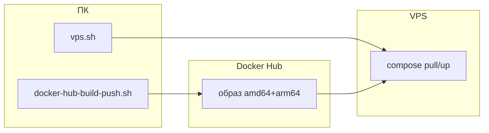

# Docker Hub, сборка и VPS — справка

Краткая цепочка: **ПК** → `docker-hub-build-push.sh` → **Hub** → **VPS** (`docker-compose.hub.yml` + `.env`). Подробнее по эксплуатации: [DEPLOY.md](../DEPLOY.md). Архитектура: [docker-vps-architecture.md](docker-vps-architecture.md).

---

## Артефакты

| Что | Где |
| --- | --- |
| Сборка | Корень репо, [Dockerfile](../Dockerfile) |
| Версия | [VERSION](../VERSION) → `APP_VERSION` в образе, label OCI |
| Образ на Hub | `DOCKER_USER/email2telegram:latest` и тег по git SHA |
| На VPS | [docker-compose.hub.yml](../docker-compose.hub.yml), `.env` с `DOCKER_IMAGE`, том `email2telegram_data` |

`DOCKER_IMAGE` на VPS должен совпадать с именем образа на Hub.

---

## Версии

- **PATCH** — [scripts/bump_code_patch.py](../scripts/bump_code_patch.py) после правок в `src/**/*.py` или `requirements.txt`.
- **MINOR** — по умолчанию перед локальным push: [scripts/bump_docker_minor.py](../scripts/bump_docker_minor.py) внутри [scripts/docker-hub-build-push.sh](../scripts/docker-hub-build-push.sh). Без bump: `NO_BUMP=1` или `--no-bump`.
- **GitHub Actions** ([docker-publish.yml](../.github/workflows/docker-publish.yml)) **не** вызывает bump MINOR: берётся `VERSION` из коммита.

Обёртка: [docker-hub-publish.sh](../scripts/docker-hub-publish.sh) → `exec docker-hub-build-push.sh`. Ещё: `make hub-push`.

Локальный push: `docker login` → `docker buildx build` **linux/amd64,linux/arm64** `--push`. Справка по Hub в браузере: `./scripts/vps.sh hub-checklist`.

---

## Скрипт ПК → VPS: [scripts/vps.sh](../scripts/vps.sh)

Читает из **`.env` в корне репо** (не затирает уже заданные в shell): `VPS_USER`, `VPS_HOST`, опционально `VPS_SSH_PORT`, `VPS_REMOTE_DIR`, `VPS_SSH_OPTS`, `VPS_SSH_VERBOSE`.

| Команда | Назначение |
| ------- | ---------- |
| `sync` | `scp` compose, `vps-update-hub.sh`, unit-файлы |
| `pull-up` | SSH: `docker compose pull` + `up -d --force-recreate` |
| `enable-timer` | systemd: периодический pull с Hub |
| `deploy` | `sync` + `pull-up` + `enable-timer` |
| `hub-checklist`, `install-docker`, `systemd-hints` | Подсказки |

Удалённые команды выполняются через **`bash -lc`**, чтобы был полный `PATH` (в т.ч. `docker`). Аргументы `user@host` и каталог после команды переопределяют `.env` для одного запуска.

`.env` с секретами на VPS **не** копируется скриптом — только вручную.

---

## Схема

---

## Чеклист «от кода до VPS»

1. При необходимости: `python3 scripts/bump_code_patch.py`, коммит.  
2. `docker login` → `./scripts/docker-hub-build-push.sh` → коммит `VERSION` при bump MINOR.  
3. На VPS: `.env` с `DOCKER_IMAGE` и секретами.  
4. С ПК: `./scripts/vps.sh sync` / `deploy` / далее `./scripts/vps.sh pull-up` при новых образах.

---

## Риски

| Симптом | Частая причина |
| ------- | -------------- |
| Неверная платформа с Mac | Образ multi-arch; на amd64-VPS тянется нужный слой. |
| Образ не тот | Опечатка в `DOCKER_IMAGE` или теге. |
| Приватный Hub | На VPS нужен `docker login`. |
| CI vs локальная версия | В Actions нет auto-bump MINOR — смотрите `VERSION` в теге. |
