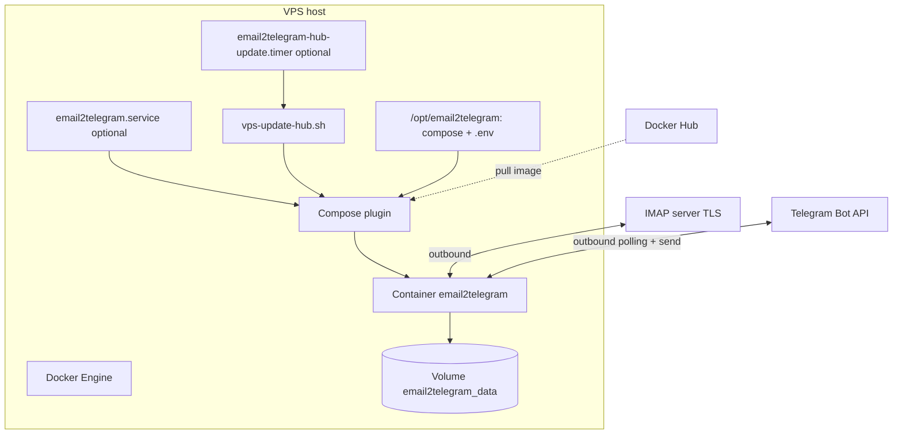
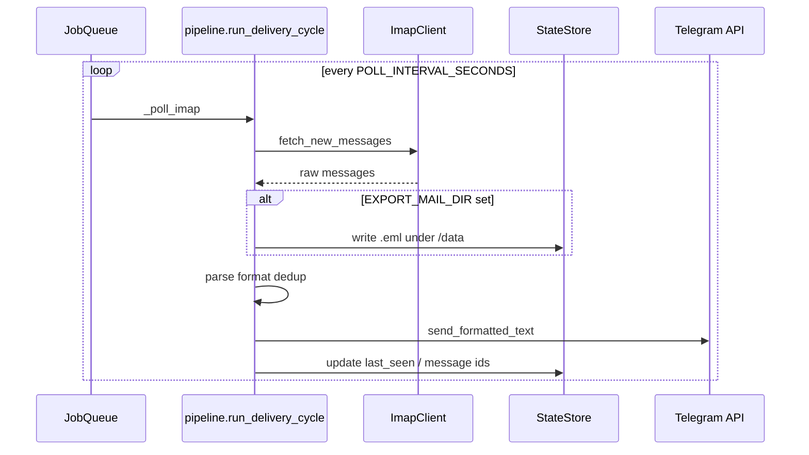
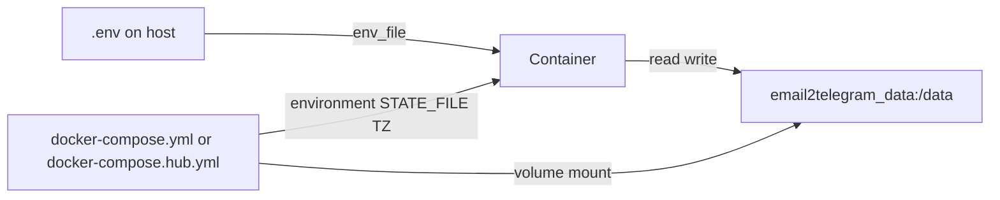

# Архитектура: Docker на VPS

Не веб-сервер: один процесс опрашивает **IMAP** и шлёт текст в **Telegram**. Порты наружу не открываются — только исходящий HTTPS. Эксплуатация: [DEPLOY.md](../DEPLOY.md).

---

## Компоненты на хосте (VPS)

| Компонент                                           | Роль                                                                                                                                                                                                                                                                                                      |
| --------------------------------------------------- | --------------------------------------------------------------------------------------------------------------------------------------------------------------------------------------------------------------------------------------------------------------------------------------------------------- |
| **Docker Engine + Compose plugin**                  | Запуск контейнера, тома, логи                                                                                                                                                                                                                                                                             |
| **Каталог проекта** (часто `/opt/email2telegram`)   | `docker-compose*.yml`, `.env`, при Hub-деплое — скопированные `vps-update-hub.sh` и unit-файлы                                                                                                                                                                                                            |
| `**.env`**                                          | Секреты и настройки (не в образе); права `chmod 600`                                                                                                                                                                                                                                                      |
| `**email2telegram.service**` (опционально)          | systemd: при загрузке `pull` + `up -d --force-recreate` — см. [deploy/email2telegram.service](../deploy/email2telegram.service)                                                                                                                                                                           |
| `**email2telegram-hub-update.timer**` (опционально) | Каждые ~10 минут запускает pull + `up -d --force-recreate` для нового образа с Hub — [deploy/email2telegram-hub-update.timer](../deploy/email2telegram-hub-update.timer), [deploy/email2telegram-hub-update.service](../deploy/email2telegram-hub-update.service), скрипт [deploy/vps-update-hub.sh](../deploy/vps-update-hub.sh) |
| **UFW / фаервол**                                   | Достаточно SSH; входящих правил под приложение нет                                                                                                                                                                                                                                                        |

---

## Компоненты внутри Docker

### Образ ([Dockerfile](../Dockerfile))

- База: `python:3.12-slim-bookworm`
- Пользователь `**appuser` (uid 1000)**, рабочая директория `/app`
- Установка зависимостей из `requirements.txt`, копирование `src/`, метка версии `APP_VERSION`
- `**VOLUME /data`** — сюда монтируется именованный том Compose
- В образе по умолчанию: `PYTHONUNBUFFERED=1`, `STATE_FILE=/data/.state.json`
- `**CMD ["python", "src/main.py"]**`

### Сервис Compose (один контейнер)

Два варианта файла:

- **[docker-compose.yml](../docker-compose.yml)** — **сборка с сервера** (`build: .`), для сценария «полный git clone на VPS».
- **[docker-compose.hub.yml](../docker-compose.hub.yml)** — **готовый образ** `image: ${DOCKER_IMAGE}`, `pull_policy: always`, без исходников на сервере.

Общие черты обоих:

- `env_file: .env` + явные `environment`: `STATE_FILE=/data/.state.json`, `TZ: ${TZ:-UTC}`
- Том `**email2telegram_data` → `/data`** (состояние и опционально экспорт `.eml`)
- Логи: `json-file`, ротация 10MB × 3 файла
- `restart: unless-stopped`, `stop_grace_period: 30s`
- **Порты не пробрасываются** — в файлах нет `ports:`

---

## Настройки (переменные окружения)

Источник правды для примера: `[.env.example](../.env.example)`. В контейнер попадают через `env_file` и блок `environment` в compose.

**Обязательные для работы приложения** (см. [src/main.py](../src/main.py)):

- **IMAP:** `IMAP_HOST`, `IMAP_USER`, `IMAP_PASS`; опционально `IMAP_PORT` (по умолчанию 993), `IMAP_MAILBOX` (по умолчанию INBOX), `POLL_INTERVAL_SECONDS` (по умолчанию 45)
- **Telegram:** `TELEGRAM_BOT_TOKEN`, `TELEGRAM_CHAT_ID`, `TELEGRAM_ALLOWED_CHAT_IDS` (список через запятую; `TELEGRAM_CHAT_ID` должен входить в allowlist)

**Специфично для Docker на VPS:**

- `STATE_FILE` задаётся compose как `/data/.state.json`, чтобы **курсор по UID** переживал пересоздание контейнера (том `email2telegram_data`)
- Опционально `TZ` — часовой пояс логов
- Для Hub: `**DOCKER_IMAGE`** в `.env` (например `user/email2telegram:latest`) — подставляется в [docker-compose.hub.yml](../docker-compose.hub.yml)

**Опционально приложения:**

- `EXPORT_MAIL_DIR` — если задать (в Docker удобно `EXPORT_MAIL_DIR=/data/mail_export`), письма дополнительно сохраняются как `.eml` на томе — см. [src/pipeline.py](../src/pipeline.py)

---

## Как компоненты взаимодействуют (логика приложения)

Точка входа: [src/main.py](../src/main.py).

1. `**load_dotenv()`** подхватывает `.env` (дублирует/дополняет то, что уже передал Docker).
2. Создаётся `**ImapClient**`, `**StateStore(path=STATE_FILE)**`, версия сервиса.
3. Поднимается `**python-telegram-bot**` `Application` с **long polling** к Telegram (`run_polling`).
4. В **JobQueue** по расписанию вызывается `**_poll_imap`** → `**run_delivery_cycle**` ([src/pipeline.py](../src/pipeline.py)): в потоке забираются новые письма с IMAP, при необходимости пишутся `.eml`, парсятся, форматируются, отправляются через Bot API в выбранный чат; состояние обновляется на диске.
5. Команда `**/start**` обрабатывается только для чатов из allowlist.

Сеть: контейнер сам инициирует исходящие TLS-сессии к провайдеру IMAP и к Telegram; **входящих подключений к VPS для этого сервиса не требуется**.

---

## Два сценария развёртывания на VPS

1. **Docker Hub** — на сервере только `docker-compose.hub.yml` + `.env` + скрипты/units при желании; образ тянется по `DOCKER_IMAGE`.
2. **Сборка на сервере** — полный клон репозитория, `docker compose up -d --build` с [docker-compose.yml](../docker-compose.yml).

Публикация образа на Hub: [host-to-docker-hub.md](host-to-docker-hub.md). С ПК на VPS (scp, удалённый compose): [host-to-vps.md](host-to-vps.md). Полный чеклист: [DEPLOY.md](../DEPLOY.md).

---

## Схемы (Mermaid)

### Развёртывание: VPS + Docker + опции systemd

### Поток данных приложения внутри контейнера

### Связь файлов конфигурации и тома

---

## Итог

- **Один сервис, один контейнер**, персистентность через **именованный том** (`state`, опционально `mail_export`).
- **Секреты** только в `.env` на хосте; образ их не содержит.
- **Сеть**: исходящий HTTPS; **порты не экспонируются**.
- **Обновления**: вручную `compose pull && up -d --force-recreate`, с ПК через скрипты из [DEPLOY.md](../DEPLOY.md), или автоматически таймером Hub-update.

